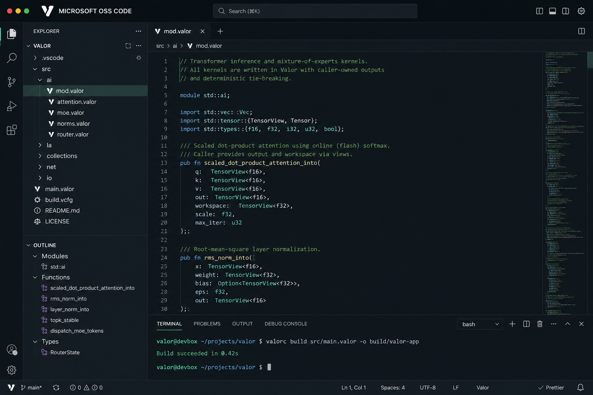

<h1 align="center">Valor Studio</h1>

<p align="center">
  <em>An editor built for a deterministic systems language — Valor, batteries included.</em>
</p>

<p align="center">
  <a href="https://github.com/louisrr/valor-studio/actions/workflows/build-installers.yml"></a>
  <a href="LICENSE.txt"></a>
  
  
</p>

<p align="center">
  
  
  
  
  
  
  
  
</p>

<p align="center">
  
</p>

Valor Studio is a distribution of [Code - OSS](https://github.com/microsoft/vscode) (the open-source core of Visual Studio Code) with first-class support for the **Valor** programming language built in. Syntax highlighting, one-key build/run, and the `valorc` compiler ship inside the editor, so you can go from a fresh `.valor` file to a native binary without installing a toolchain separately.

## The Valor language

Valor is a statically typed, ahead-of-time compiled systems language built for workloads where **the result and the timing must be reproducible**: numerical computing, deep-learning kernels, high-frequency trading, and deployable services. If you've written C, Rust, or C++, Valor's surface will feel familiar — declarations lead with a type, blocks use braces, statements end with a semicolon — with a few deliberate differences aimed at determinism.

- **Deterministic by design.** The same source, built the same way, produces the same bytes and the same run-to-run behavior. A strict mode (`--strict-deterministic`) turns any determinism violation into a hard compile error.
- **Contracts and invariants are first-class.** Preconditions (`requires`), postconditions (`ensures`), and reusable constraint sets (`invariant`) let the compiler *prove* properties — or lower them to runtime checks when it can't.
- **Deep learning is syntax, not a library.** Operators like `matmul`, `attention`, `softmax`, and `layernorm` are built into the language, so models compose as first-class expressions.
- **Cost is part of the type system.** Declare a worst-case budget (`@cost`) and have the compiler bound tail latency, making p99.999 a *proven ceiling* rather than a measurement.
- **Native performance.** Valor compiles through LLVM to native machine code.

### A first taste

```valor
module app;

// Return type leads, parameters are `Type name`.
public i64 fib(i64 n) {
    if (n < 2) { return n; }
    return fib(n - 1) + fib(n - 2);
}

public i32 main() {
    i64 answer = fib(10);
    return 0;
}
```

### What Valor is good at

| Domain | What the language gives you |
|---|---|
| Numerics & linear algebra | Fixed and dynamic `Tensor`/`Vector`/`Matrix` types, exact reproducibility |
| Deep learning | Built-in `matmul`, `attention`, `conv2d`, `softmax`, normalization operators |
| Systems & HFT | Bounded, constant-time code paths; `@noalloc`; worst-case cost contracts |
| Services | A structured `service` unit with deployment/manifest tooling |

## Getting Valor Studio

### Download a build

Prebuilt installers are produced by the [**Build Installers**](https://github.com/louisrr/valor-studio/actions/workflows/build-installers.yml) workflow for macOS, Windows, and Linux:

- **Tagged releases** attach installers to the [Releases](https://github.com/louisrr/valor-studio/releases) page.
- **Latest development builds** are on the Actions run pages — open the most recent successful run and download the `valor-studio-<platform>-<arch>` artifact (`.dmg`, `.exe`, `.deb`, or `.rpm`).

### Run from source

Requires **Node.js** (the version pinned in [`.nvmrc`](.nvmrc)), **Python 3**, and a C/C++ toolchain (Xcode CLT on macOS, Build Tools on Windows, `build-essential` on Linux).

```bash
git clone https://github.com/louisrr/valor-studio.git
cd valor-studio
npm ci
# macOS / Linux:
./scripts/code.sh
# Windows:
.\scripts\code.bat
```

## Writing Valor in Valor Studio

1. Open or create a file ending in **`.valor`** — you'll get Valor syntax highlighting and outline symbols immediately.
2. Build or run without leaving the editor:
   - **Command Palette** (`Cmd/Ctrl+Shift+P`) → **Valor: Build** or **Valor: Run**.
   - or, from the integrated terminal: `valorc build src/main.valor -o build/valor-app`.
3. Diagnostics from `valorc` appear inline in the editor and in the **Problems** panel.

The compiler path is auto-detected from the bundled binary. To point at a different `valorc`, set **`valor.compiler.path`** in Settings.

### Supported target platforms

Valor's backend targets these platform/architecture pairs:

- **Apple** — AArch64 (Apple silicon, macOS)
- **Android** — AArch64 and x86-64
- **Linux** — x86-64
- **FreeBSD** — x86-64
- **Windows** — x86-64

## The bundled compiler

The Valor extension ([`extensions/valor`](extensions/valor)) ships a per-platform `valorc` under `extensions/valor/bin/<platform>-<arch>/`. The [Build Installers](.github/workflows/build-installers.yml) workflow builds `valorc` from the [Valor compiler](https://github.com/louisrr/valorlang) source for each OS and bundles it into the installer, so the editor and the compiler are always released together.

> **Version note.** Valor Studio tracks Valor **v0.1**. A few language constructs are recognized by the parser but not yet fully lowered by the backend; those are flagged **staged** in the language docs.

## Building installers

Installers for all three OSes are produced by GitHub Actions — see [`.github/workflows/build-installers.yml`](.github/workflows/build-installers.yml). Trigger it from the **Actions** tab (*Run workflow*) or by pushing a `v*` tag.

## License

Valor Studio is a fork of [Code - OSS](https://github.com/microsoft/vscode), © Microsoft Corporation, and is distributed under the [MIT](LICENSE.txt) license. Third-party components retain their own licenses; see [`ThirdPartyNotices.txt`](ThirdPartyNotices.txt).
